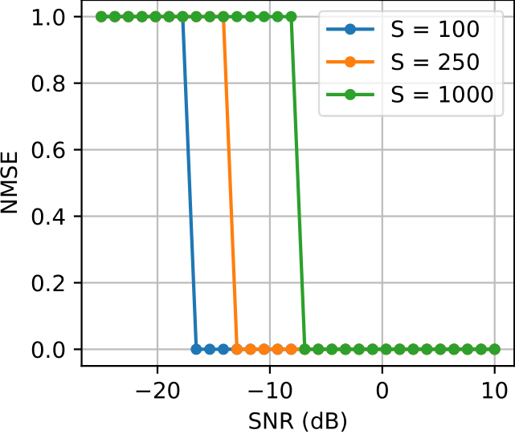
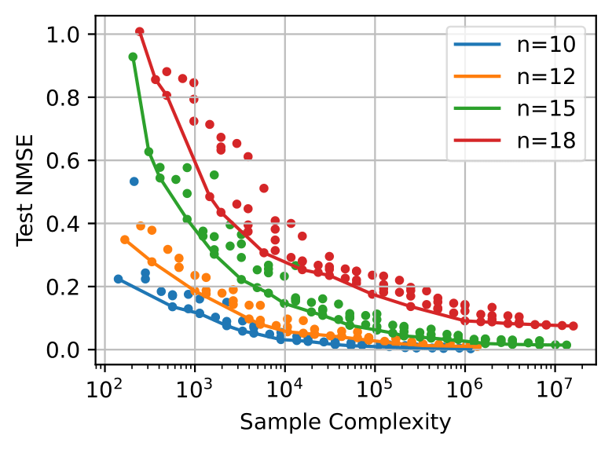
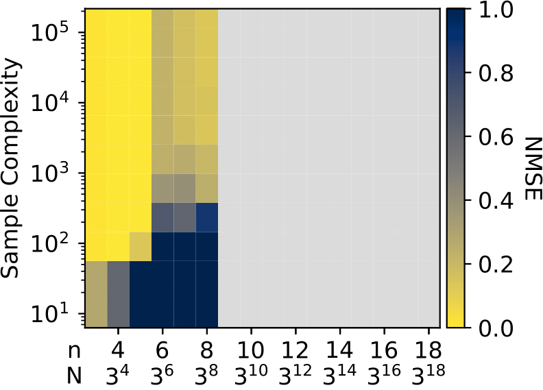
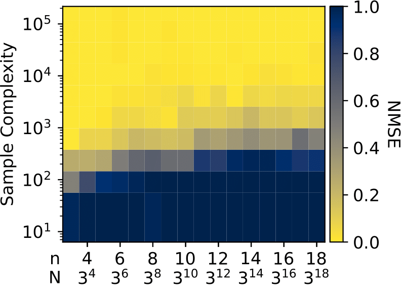
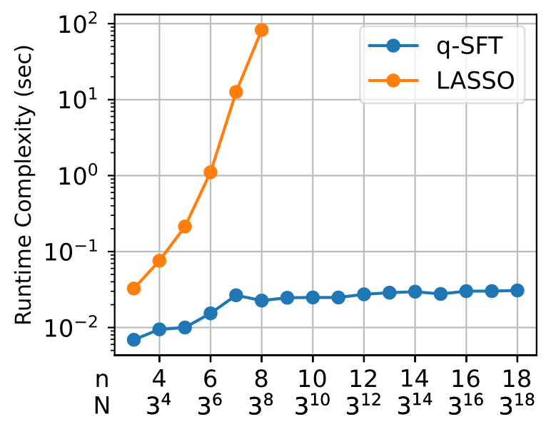

# Efficient Sparse q-ary Fourier Transforms

This repository contains code for the paper:

_"Efficiently Computing Sparse Fourier Transforms of_ $q$_-ary Functions" Yigit Erginbas*, Justin Kang*, Amirali Aghazadeh, Kannan Ramchandran_

### Table of Contents
* [Abstract](#abstract)
* [Quick Start](#quickstart)
* [Signals](#signals)
  * [Example: Computational Biology](#rna)
* [Comparing with LASSO](#LASSO)

### Abstract
<a id=abstract></a>
Fourier transformations of pseudo-Boolean functions are popular tools for analyzing functions of binary sequences. Real-world functions often have structures that manifest in a sparse Fourier transform, and previous works have shown that under the assumption of sparsity the transform can be computed efficiently. But what if we want to compute the Fourier transform of functions defined over a $q$-ary alphabet? These types of functions arise naturally in many areas including biology. A typical workaround is to encode the $q$-ary sequence in binary however, this approach is computationally inefficient and fundamentally incompatible with the existing sparse Fourier transform techniques. Herein, we develop a sparse Fourier transform algorithm specifically for $q$-ary functions of length $n$ sequences, dubbed $q$-SFT, which provably computes an $S$-sparse transform with vanishing error as $q^n$ goes to $\infty$ in $O(Sn)$ function evaluations and $O(S n^2 \log q)$ computations, where $S = q^{n\delta}$ for some $\delta < 1$. Under certain assumptions, we show that for fixed $q$, a robust version of $q$-SFT has a sample complexity of $O(Sn^2)$ and a computational complexity of $O(Sn^3)$ with the same asymptotic guarantees. We present numerical simulations on synthetic and real-world RNA data, demonstrating the scalability of $q$-SFT to massively high dimensional $q$-ary functions.

### Quick Start
<a id=quickstart></a>
The main functionality of our algorithm is availible in the `QSFT` class. Example usage is given below:

```python
from synt_exp.synt_src.synthetic_signal import get_random_signal
test_signal = get_random_signal(n=n, # Generate the test signal sparse in the fourier domain
                                q=q,
                                sparsity=sparsity,
                                a_min=a_min,
                                a_max=a_max,
                                noise_sd=noise_sd)
transformer = QSFT(
    query_method="complex",
    delays_method="identity",
    reconstruct_method="noiseless",
    num_subsample=3,
    b=4
)
ft, (n_used, n_used_unique, _), peeled = spright.transform(test_signal, verbose=False, report=True)
```

<p align="center">

</p>

####  Example: Computational Biology
<a id=rna></a>

<p align="center">

</p>

### Comparing with LASSO
<a id=LASSO></a>

<p align="center">

</p>


<p align="center">

</p>
<p align="center">

</p>
